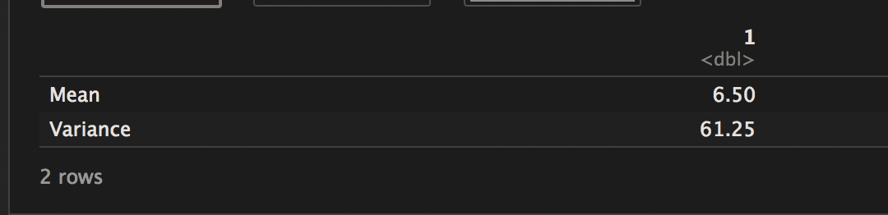
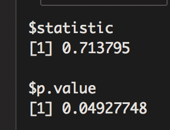
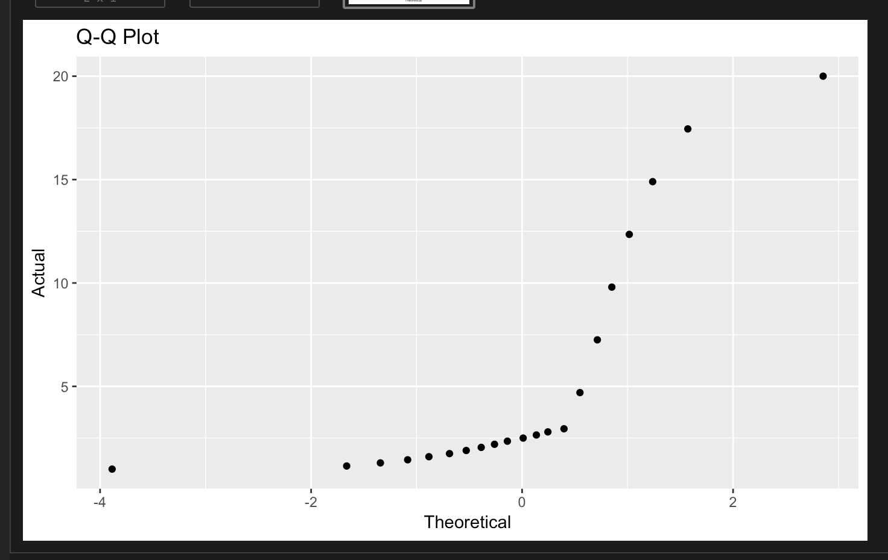
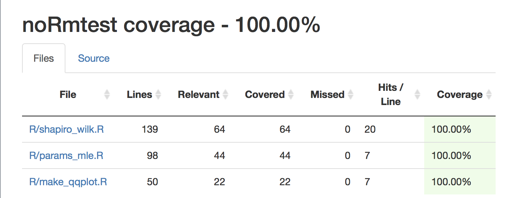

# noRmtest

Contributors: Constantin Shuster, Sylvia Lee, Richie Zitomer

This is an R package that tests your data for normality!

[](https://travis-ci.org/UBC-MDS/noRmtest)

### Website
Where the original R package came from can be found [here](https://github.com/UBC-MDS/noRmtest)

Deployed website can be found [here](https://jhu-statprogramming-fall-2022.github.io/biostat840-project3-pkgdown-YangzhenyuGao/)

5 things I customized in my pkgdown website:
(1)Change the bootswatch theme; (2)Change the color of page background; (3)Change the text color; 
(4)Override the default fonts used for the majority of the text, for headings and for code;
(5)Change the color used for syntax highlighting in code blocks;
(6)Change the foreground and background colours used for inline code;
(7)Reorganise the navbar

### Overview    
A common and important assumption that is made by many (and commonly used) parametric statistical methods (t-tests, ANOVA and linear regression) is that the dependent variable (response variable) is normally distributed across all categories of the independent variables (predictors). Thus testing for normality in the data is an important step before applying parametric statistical methods.

Graphical and statistical methods can be used to test whether sample data was drawn from a normal population. In normality testing it is important to remember that our null hypothesis is that the sample data is **NOT different** than a normal population with the same mean and variance. If we **fail to reject** this null hypothesis - meaning resultant p-value is > 0.05 - then we would be able to apply the appropriate parametric statistical methods to our data. Normality testing can also be used to check whether any sample data approximates a normally distributed population. More on this topic can be found [here](https://www.ncbi.nlm.nih.gov/pmc/articles/PMC3693611/) and [here](http://webspace.ship.edu/pgmarr/Geo441/Lectures/Lec%205%20-%20Normality%20Testing.pdf).


### Usage
This package will test your data for normality using a graphical and a statistical method. As a graphical method, this package lets you see a quantile-quantile plots (Q-Q plot) in order for you to visualize whether the data closely approximates a straight line - thereby indicating it is normally distributed. As a statistical method, this package lets you calculate the Shapiro-Wilk test score along with the corresponding p-value. The Shapiro-Wilk test provides better power than most other statistical normality tests, as long as **most of the values are unique**, see [here](https://www.graphpad.com/guides/prism/7/statistics/index.htm?stat_choosing_a_normality_test.htm) for more information. This package will also derive the parameters that would fit your data to a normal distribution using maximum likelihood estimation.


### Example
```{r}
library(noRmtest)
data <- c(1,2,3,20) # Very simple example of a very non-normal dataset
```

```{r}
(params_mle(data)) # Returns a dataframe with the MLE mean and variance if the data was normal
```


```{r}
(shapiro_wilk(data)) # Returns a list with the Shapiro statistic and the p.value
```



```{r}
(make_qqplot(data)) # Returns a Q-Q plot to check for normality
```



### Installation Instructions
In order to install the package, first make sure you have devtools installed and loaded by running (in an R environment):
```{r}
install.packages("devtools", build_vignettes = TRUE)
library(devtools) # load devtools
```

Then run the following command to install our package:
```{r}
devtools::install_github("UBC-MDS/noRmtest", build_opts = c("--no-resave-data", "--no-manual"))
```
Then import the functions that you need.

The package has the following dependencies:

- ggplot2
- tidyverse
- nlme


### Package functions:  
1. `make_qqplot()`
    - **description:** this function will read in data and will create a QQ-plot for each continuous variable in the data. It will output a dictionary of plot objects and print them to screen as default (the user will have the option of not printing plots).
    - **input:** dataframe, list, vector, array, or matrix
    - **output:** list of plots
2. `shapiro_wilk()`
    - **description:** this function will read in data and will output the shapiro-wilks test for normality for each continuous variable in the data. The output will be  tuple of lists where the first list contains the test statistics in the order of the variables in the input dataframe and the second list contains the p-values in the same respective ordering.   
    - **input:** dataframe, list, vector, array, or matrix
    - **output:** tuple of lists
        - first list: test statistic
        - second list: p-value
3. `params_mle()`
    - **description:** this function will read in data and will output the mean and variance for the empirical distribution of the data given that the data is normal for each continuous variable in the data. The output will be a dataframe with one row for the mean and one row for the variance with the columns presenting the original variables in the data.
    - **input:** dataframe, list, vector, array, or matrix
    - **output:** dataframe
        - columns: variables
        - rows: mean, variance


### Branch Coverage
We have tests to ensure that are package is working as expected and will continue to do so into the future. As you can see, we have close to full branch coverage:



### Where does this fit into the R ecosystem

In the `stats` package in R there is a Shaprio-Wilk test function named [`shapiro.test()`](https://stat.ethz.ch/R-manual/R-devel/library/stats/html/shapiro.test.html). The input is a numeric vector and the output is list containing the statistic value and the p-value. There is a package called `ggpubr` which has a [`ggqqplot()`](https://www.rdocumentation.org/packages/ggpubr/versions/0.2/topics/ggqqplot) where the input is a dataframe and the output is a `ggplot2` object. Interestingly, the `car` package also has a [`qqPlot()`](https://www.rdocumentation.org/packages/car/versions/3.0-2/topics/qqPlot) function which can be used to make a Q-Q plot of any data. Additionally, the `stats4` package provides [`mle()`](https://stat.ethz.ch/R-manual/R-devel/library/stats4/html/mle.html) which performs maximum likelihood estimation. However this function may be less intuitive as it requires users to define the likelihood function.

`noRmtest` is designed to centralize operations that are related to normality assumption testing and parameter estimation. Although all of functions in this `noRmtest` package may be acquired elsewhere, this package is designed to eliminate the hassle to import functions from different packages in which the users may or may not have. 
